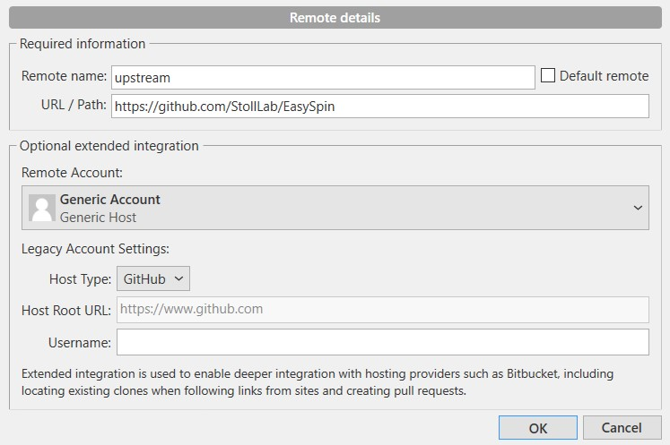
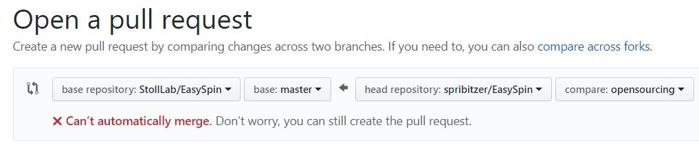

# Contributing

Please always look at this file *before* contributing to EasySpin.
In this document you can find the [contributing](#Acceptable-contributions) and [coding](#coding-style)  guidelines, how to come up with good [commit messages and branch names](#Commit-messages-and-branch-names) as well as all the steps necessary to set up your own [development environment](#Forking-EasySpin) and [creating pull requests](#Creating-a-pull-request). 

## Acceptable contributions

The following contributions are accepted:

- fix bugs for existing functions
- enhance the API or implementation of an existing function
- adds a function that is only slightly modified from a StackOverflow answer
- is tested

In the case of adding a new function or feature:

- NOT break any previously existing features and functions
- all tests must pass
- new tests must be added
- documentation must be added

## Coding style

## Commit messages and branch names

## Forking EasySpin

You're going to need a few things set up correctly in order to be able to contribute to EasySpin.

First of all, you are going to need a GitHub account (if you don't already have one).
Then, you will need to know the basics of working with `git`.
If you are new to using version control software, it might be easier to use one of the graphical interfaces like [SourceTree](https://www.sourcetreeapp.com/) or [GitHub desktop](https://desktop.github.com/).
This guide assumes you have a basic understanding of `git` and know how to make a commit and create local branches.

#### The following instructions show you how to create a pull request using *SourceTree*:

1. Fork the EasySpin repo
    - go to https://github.com/StollLab/EasySpin
    - find the `Fork` button in the top right corner and click on it
    - this creates a copy of EasySpin for your GitHub (e.g. `yourusername/EasySpin`) 
2. Clone your fork to your computer
    - make sure to use the adress from *your* EasySpin repository
3. Make sure your repository stays up to date by adding the original EasySpin (the upstream) repository
    - find and click the `Settings` button in the top right corner of the tab in SourceTree
    - add a new remote:
        - Remote name: upstream
        - URL/path: https://github.com/StollLab/EasySpin
        
    - you should now have two remote repository paths
4. Link the `EasySpin/master` branch to your local `master` branch
    - fetch from all repositories via the `Fetch` button
    - right click your master branch
    - in the popup menu select `Track remote branch` and then `upstream/master`
    - you now can pull updates from the EasySpin repository - time to get working on your code!
5. Create a new local branch
    - give it a good descriptive name (see the [examples](#Commit-messages-and-branch-names))
6. Start coding away and creating commits to that branch
7. Once you have made a commit, you can push that commit to your forked repository

#### If you prefer the CLI of `git`, this is how you fork EasySpin:
1. Fork the EasySpin repo
    - go to https://github.com/StollLab/EasySpin
    - find the `Fork` button in the top right corner and click on it
    - this creates a copy of EasySpin for your GitHub (e.g. `yourusername/EasySpin`) 
2. Clone your fork to your computer
    - first navigate to the folder where you want to create a copy of EasySpin
    - make sure to use the adress from *your* EasySpin repository
        ```git
        git clone git@github.com:yourusername/EasySpin.git
        ```
3. Stay up-to-date by addding the original EasySpin repository (the upstream repository) as a remote
    ```git
    git remote add upstream git@github.com:StollLab/EasySpin.git
    git fetch upstream
    ```
4. Have your local master branch track the EasySpin/master branch
    ```git
    git branch --set-upstream-to=upstream/master master
    ```
5. Create a new local branch
    - give it a good descriptive name (see the [examples](#Commit-messages-and-branch-names))
        ```git
        git checkout -b yourgood/branchname
        ```
6. Start coding away and creating commits to that branch
7. Once you have made a commit, you can push to your forked repository
    ```git
    git push origin yourgood/branchname
    ```
    or if you want to make your life easier in the future
    ```git
    git push --set-upstram origin yourgood/branchname
    ```
    and from now on, as long as you are on this branch, all you have to do to push changes to your forked repository is 
    ```git
    git push
    ```


## Creating a pull request
1. Create a pull request
    - go to the github website of your forked repository
    - if you do this within an hour of pushing a commit, there will be a button for that on the front page. If you can't find it, you have to click on the `Pull requests` tab and create a `New pull request`
    - Start the name of the pull request with `WIP:` to let everyone know that it is work in progress
    - Make sure the pull request is comparing across forks, it should look something like this:
    
    - use the following settings:
        - Source repository: StollLab/EasySpin
        - base: master
        - head repository: yourusername/EasySpin
        - compare: the name of the branch you created
    - provide a description of what your PR does and why you think it should be added to EasySpin
    - optionally, you can also assign reviewers, assignees and labels
    - if everything looks okay, create the pull request!
2. The EasySpin community can now see what you are doing and track your progress
3. Once you are at a point where you think your contribution is ready to be merged into EasySpin, you can remove the `WIP` from the title and request a repository maintainer to review and merge your PR
    - PRs will only be merged if they pass all the tests
    - it is always a good idea to pull updates from EasySpin to your local master branch and to include these in your branch via rebase or a merge


