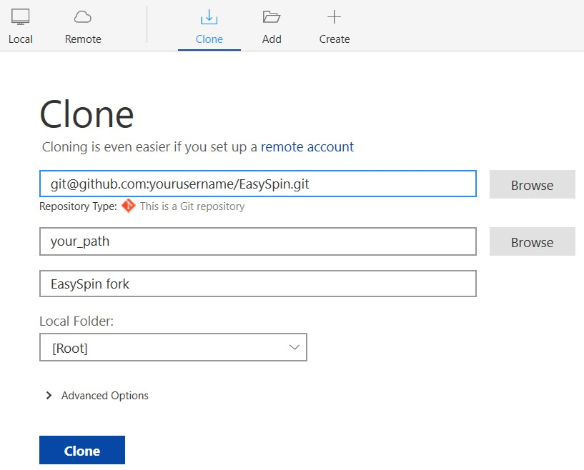
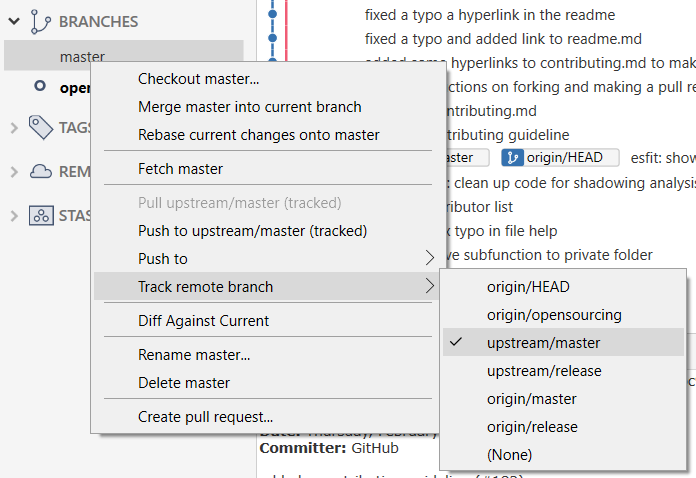

# Contributing

Please read this carefully *before* contributing to EasySpin.

To contribute bug reports and feature suggestions, open an issue on EasySpin's [list of issue](https://github.com/StollLab/EasySpin/issues). To contribute code to EasySpin, create a fork and then a [pull request (PR)](https://help.github.com/en/github/collaborating-with-issues-and-pull-requests/about-pull-requests).

This document provides guidelines for [contributing](#Acceptable-contributions), [coding style](#coding-style), and [commit messages and branch names](#Commit-messages-and-branch-names). It also describes how to [fork EasySpin](#Forking-EasySpin), [stay up-to-date](#Keeping-your-EasySpin-fork-up-to-date) and [create pull requests](#Creating-a-pull-request).

The overall goal of EasySpin is to provide a user-friendly framework of analyzing and simulating spectra in EPR spectroscopy. Support is limited to most standard EPR experiments. Also, the analysis of data form pulse dipolar EPR spectroscopy (DEER, etc) is expressely excluded, since that's its own big field with dedicated software.

## Acceptable contributions

The following contributions are accepted:

- documentation fixes
- bug fixes for existing functions
- interface or implementation improvements of an existing function
- additional tests for exiting functions
- significant performance improvements

We do not accept:

- new functions or features that have not been previously discussed in an issue
- changes to the API of existing functions that have not been previously discussed in an issue
- tiny code refactors and "beauty" edits
- very small performance improvements

Propose and discuss any new functionality first in an [issue](https://github.com/StollLab/EasySpin/issues). If it's decided there that the feature is worthwhile, the following guidelines should be followed:

- Do not break any previously existing features and functions
- All tests must pass
- New tests must be added (see [here](/tests/TESTING.md) on how to write tests)
- Documentation must be added (see [here](/releasing/DOCUMENTATION.md) on how to build a local copy of the documentation)
- Examples must be added

## Coding style

Currently, there are no formal coding style guidelines. Check out the existing code base to get an idea of how to write code. A few principles are worth mentioning:

- The main criterion for code is readability. Don't sacrifice that for performance. Prefer simple over complicated data structures. Avoid crytpic code.
- Write code such that it runs in MATLAB R2016b. Don't use more recent MATLAB features.
- Use 2-space indents, instead of 4-space indents. This is because some EasySpin functions are deeply nested.
- Use variable names that are explicit, but not too long. USe camelCase instead of snake_case.
- Add a judicious amount of white space and empty line to make the code readable.
- Include references (incl. DOI and equation number) when using equations from the scientific literature.
- Write tests that are as simple as possible. Write as many tests as needed to cover all the execution paths through a function.

## Commit messages and branch names

Use descriptive and specific commit messages and branch names. If a commit relates to an issue, include the issue number in the commit message. Do not combine two different lines of work into one commit.

## Forking EasySpin

You will need a few things set up correctly in order to be able to contribute to EasySpin.

First of all, you need a GitHub account (if you don't already have one).
Then, you will need to know the basics of working with `git`.
If you are new to using version control software, use one of the GUI clients like [SourceTree](https://www.sourcetreeapp.com/) or [GitHub desktop](https://desktop.github.com/).
This guide assumes you have a basic understanding of `git` and know how to make a commit and create local branches.

1. Fork the EasySpin repo
    - go to https://github.com/StollLab/EasySpin
    - find the `Fork` button in the top right corner and click on it
        <p align="center">
        
        </p>
    - this creates a copy of EasySpin for your GitHub account (`yourusername/EasySpin`) 
2. Clone the new repository with your git tool of choice
    <p align="center">
    
    </p>

#### The following instructions show you how to create a pull request using *SourceTree*:

1. Fork the EasySpin repo
2. Clone your fork to your computer
    - make sure to use the adress from *your* EasySpin repository
    <p align="center">
    
    </p>
3. Make sure your repository stays up to date by adding the original EasySpin (the upstream) repository
    - find and click the `Settings` button in the top right corner of the tab in SourceTree
    - add a new remote:
        - Remote name: upstream
        - URL/Path: https://github.com/StollLab/EasySpin
            <p align="center">
            
            </p>
    - you should now have two remote repository paths
4. Have your local `master` track `EasySpin/master`
    - first, fetch from all repositories via the `Fetch` button
        <p align="center">
        
        </p>
    - right click your master branch and in the popup menu select `Track remote branch` and then `upstream/master`
        <p align="center">
        
        </p>
    - you now can pull updates from the EasySpin repository - time to get working on your code!
5. Create a new local branch
    - give it a good descriptive name (see the [examples](#Commit-messages-and-branch-names))
6. Start coding and creating commits to that branch
7. Once you have made a commit, you can push that commit to your forked repository
8. Make a [pull request](#Creating-a-pull-request) from your branch to the EasySpin repository to get your contribution reviewed

#### If you prefer the CLI of `git`, this is how you fork EasySpin:
1. Fork the EasySpin repo
2. Clone your fork to your computer
    ```git
    git clone git@github.com:yourusername/EasySpin.git
    ```
     - make sure to use the adress from *your* EasySpin repository
3. Stay up-to-date by addding the original EasySpin repository (the upstream repository) as a remote
    ```git
    git remote add upstream git@github.com:StollLab/EasySpin.git
    git fetch upstream
    ```
4. Have your local master branch track the `EasySpin/master` branch
    ```git
    git branch --set-upstream-to=upstream/master master
    ```
5. Create a new local branch
    ```git
    git checkout -b yourgood/branchname
    ```
    - give it a good descriptive name (see the [examples](#Commit-messages-and-branch-names))
6. Start coding and creating commits to that branch
7. Once you have made a commit, you can push to your forked repository
    ```git
    git push origin yourgood/branchname
    ```
    or if you want to make your life easier in the future
    ```git
    git push --set-upstram origin yourgood/branchname
    ```
    and from now on, as long as you are on this branch, all you have to do to push changes to your forked repository is 
    ```git
    git push
    ```
8. Make a [pull request](#Creating-a-pull-request) from your branch to the EasySpin repository to get your contribution reviewed

## Keeping your EasySpin fork up-to-date
If you just forked your EasySpin, your fork will be up-to-date with the source repository (which we called upstream before). 
But if you have been working on your project for a while, there might have been a lot of changes to the original repo since you forked it, changes that put your repo out of sync.
Fortunately, it is very easy to incorporate those into your fork.

#### Using *SourceTree*:
1. checkout the master branch
    <p align="center">
    
    </p>
2. pull updates from github.com/stolllab/EasySpin.git
    <p align="center">
    
    </p>
    - now your local `master` branch is up to date
3. Let's make sure that your forked repository on GitHub is aware of those changes as well and push to it
        - make sure you push to `origin`(your repository) and not to `upstream` (the EasySpin repo)
        <p align="center">
        
        </p>
4. Now checkout the branch you were working on and merge the `master` branch into it
        <p align="center">
        
        </p>
    - if everything went well, there won't be any merge-conflicts and you now have the newest version of EasySpin to continue working with!


#### Using the CLI of `git`:
1. switch to your local `master` branch (which we set to track `upstream/master`) and fetch
    ```git
    git checkout master
    git fetch upstream
    ```
2. merge changes from the upstream repository into your `master` branch and push the new commits to your own repository
    ```git
    git merge upstream/master
    git push origin master
    ```
3. now switch back to the branch that you have been working on and merge the `master` branch into it to have the newest code available (alternatively you can use the `rebase` command, if you know how)
    ```git
    git checkout yourgood/branchname
    git merge master
    ```


## Creating a pull request

1. Create a pull request
    - go to the github website of your forked repository
    - if you do this within an hour of pushing a commit, there will be a button for that on the front page. If you can't find it, you have to click on the `Pull requests` tab and create a `New pull request`
    - Start the name of the pull request with `WIP:` to let everyone know that it is work in progress and that your code is not yet ready to be merged
    - Make sure the pull request is comparing across forks, it should look something like this:
        <p align="center">
        
        </p>
    - use the following settings:
        - Source repository: StollLab/EasySpin
        - base: master
        - head repository: yourusername/EasySpin
        - compare: the name of the branch you created
    - provide a description of what your PR does and why you think it should be added to EasySpin
    - optionally, you can also assign reviewers, assignees and labels
    - if everything looks okay, create the pull request!
2. The EasySpin community can now see what you are doing and track your progress
3. Once you are at a point where you think your contribution is ready to be merged into EasySpin, you can remove the `WIP` from the title and request a repository maintainer to review and merge your PR
    - PRs will only be merged if they pass all the tests
    - it is always a good idea to pull updates from EasySpin to your local master branch and to include these in your branch via rebase or a merge
